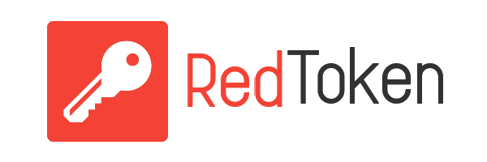

# :closed_lock_with_key: RedToken

> **Secure Authorization Web Portal & Key-Value Storage Server** to link all of your services.

## :bulb: Concept Keys

- Users' store with basic data
- Apps' store with icon, name, description and etc
- Each user contains own containers with name and description
- Each user can connect any app with own account
- Each user can create a new app or container in the public space
- Any connected app can add own container or get R/W access to user's containers
- Any authorized app can make R/W operations with user's containers 
- User can revoke apps' access
- The server can give access token with permissions for app and the app can R/W with specific containers
- All containers encrypted by user's hashed password
- Main encryption algorithm for concrete user is SHA512(SHA512(pass)^SHA512(sail)). Sail from config 

## :cyclone: Technologies

- Full Support of OAuth 2.0

## :notebook: TODO

- [ ] CI/CD with Docker
- [ ] HTTPS Server
- [ ] Configurable CORS in config.yml

